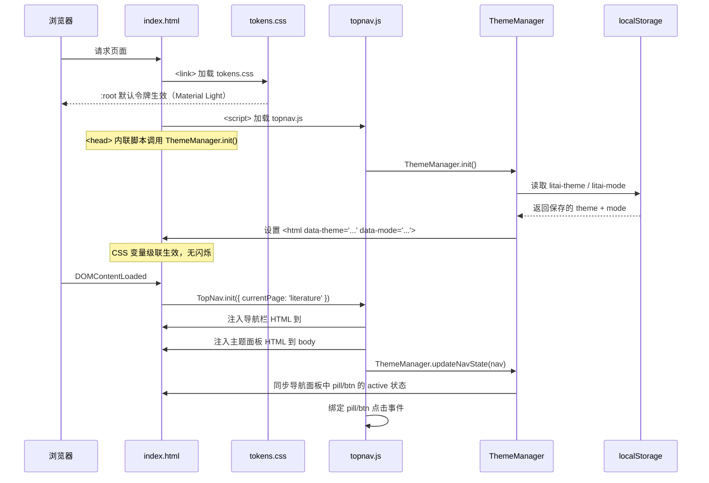
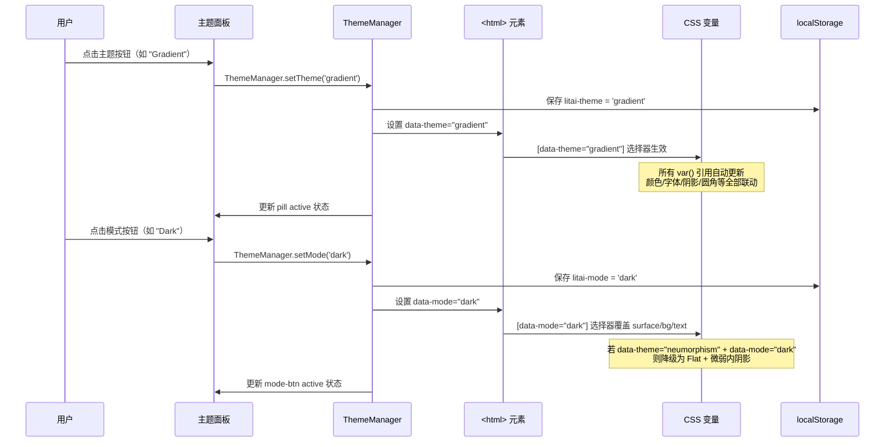
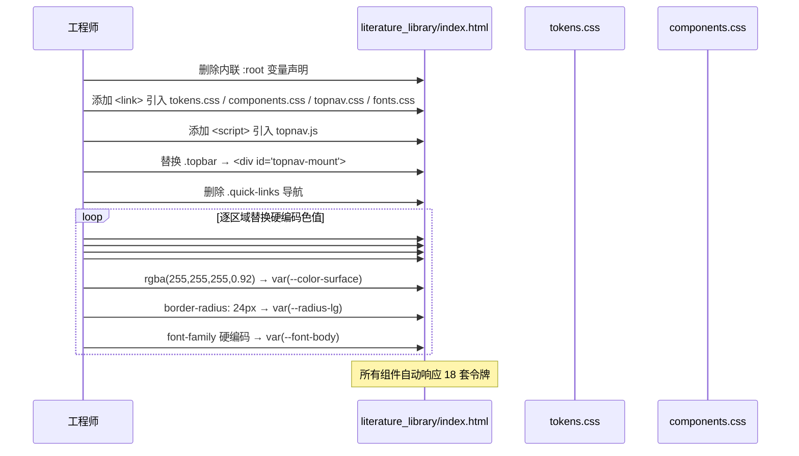
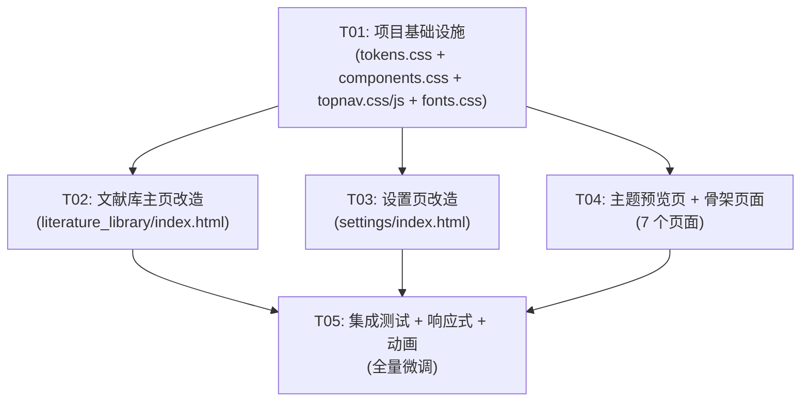

# ARCH: literature-ai 前端 UI 重设计 — 系统架构设计 + 任务分解

> **架构师**: 高见远 (Gao)  
> **日期**: 2026-05-24  
> **版本**: v1.0  
> **技术栈**: 纯 HTML / CSS / JS（无框架），后端 FastAPI  

---

## 1. 实现方案 + 框架选型

### 1.1 核心技术挑战

| # | 挑战 | 难度 | 解决思路 |
|---|------|------|---------|
| C1 | 6 主题 × 3 模式 = 18 套令牌组合的管理与切换 | 高 | CSS 自定义属性分层架构：`:root` 定义默认 → `[data-theme]` 覆盖主题 → `[data-mode]` 覆盖模式 |
| C2 | 多页 HTML 共享导航组件的复用 | 中 | `topnav.js` 通过 DOM 注入统一导航 HTML；各页面仅需 `<div id="topnav-mount">` 占位 |
| C3 | 文献库页面 97KB 大文件的主题变量替换 | 高 | 分区替换策略：先替换 :root 变量声明，再逐区域替换硬编码色值 |
| C4 | Neumorphism 主题 Dark 模式降级为 Flat + 微弱内阴影 | 中 | `[data-mode="dark"][data-theme="neumorphism"]` 选择器单独覆盖阴影令牌 |
| C5 | 设置页现有功能与新主题系统的集成 | 中 | 保留设置页全部 API 逻辑，仅替换 CSS 变量层和导航结构 |

### 1.2 技术方案

**多页 HTML + shared/ 共享组件**

- 保持当前多页 HTML 架构不变（Q5 决策）
- 新建 `frontend/shared/` 目录，存放全局 CSS 令牌、组件样式、导航组件
- 各页面通过相对路径 `<link>` / `<script>` 引入共享资源
- `topnav.js` 在 DOMContentLoaded 时向 `<div id="topnav-mount">` 注入完整导航 HTML

**CSS 变量分层架构**

```
:root                          ← 全局固定令牌（success, warning, danger, nav-height 等）
  └─ [data-theme="material"]   ← Material 主题 Light 模式令牌（默认）
  └─ [data-theme="expressive"] ← Expressive 主题 Light 模式令牌
  └─ [data-theme="gradient"]   ← Gradient 主题 Light 模式令牌
  └─ [data-theme="impeccable"] ← Impeccable 主题 Light 模式令牌
  └─ [data-theme="neumorphism"]← Neumorphism 主题 Light 模式令牌
  └─ [data-theme="refined"]    ← Refined 主题 Light 模式令牌
       └─ [data-mode="dark"]   ← Dark 模式覆盖（跨主题统一 surface/bg/text）
            └─ [data-mode="dark"][data-theme="neumorphism"]  ← Neumorphism Dark 降级 Flat
       └─ [data-mode="eyecare"]← Eye-care 模式覆盖（跨主题统一暖黄色系）
            └─ [data-mode="eyecare"][data-theme="neumorphism"] ← Neumorphism Eye-care 阴影适配
```

**主题切换 JS 实现方案**

- `<html>` 标签同时设置 `data-theme` 和 `data-mode` 两个属性
- `ThemeManager` 类封装切换逻辑，自动持久化到 `localStorage`
- 存储 key: `litai-theme`（主题名）、`litai-mode`（模式名）
- 页面加载时 ThemeManager 读取 localStorage 并应用，避免闪烁（FOUC）
- 切换时同时更新 `<html>` 属性和导航面板中的激活状态

**导航组件复用方案**

- `topnav.js` 导出 `TopNav` 类，接收 `{ currentPage, basePath }` 配置
- 各页面在 `<head>` 中引入 `<script src="../../shared/topnav.js">`
- `<body>` 开头放置 `<div id="topnav-mount"></div>`
- TopNav.init() 向 mount 点注入完整导航 HTML + 主题切换浮动面板
- 当前页面导航项通过 `currentPage` 参数自动高亮

---

## 2. 文件列表及相对路径

### 2.1 新建文件

| 文件路径 | 职责 |
|---------|------|
| `frontend/shared/tokens.css` | 设计令牌：全局固定令牌 + 6 主题 × 3 模式 CSS 变量 |
| `frontend/shared/components.css` | 公共组件样式：button / card / input / badge / tab / modal / toast / skeleton |
| `frontend/shared/topnav.css` | 顶部导航栏 + 主题切换浮动面板样式 |
| `frontend/shared/topnav.js` | TopNav 类 + ThemeManager 类 + 导航注入 + 主题切换逻辑 |
| `frontend/shared/fonts.css` | Google Fonts @import 声明（6 主题所需全部字体） |

### 2.2 修改文件

| 文件路径 | 当前状态 | 改造范围 |
|---------|---------|---------|
| `frontend/pages/literature_library/index.html` | 最复杂（97KB），含完整功能 | 删除内联 :root 变量 → 引入 shared CSS/JS → 替换 topbar 为 topnav-mount → 硬编码色值替换为 var() → Neumorphism 适配 |
| `frontend/pages/settings/index.html` | 完整功能（40KB），暗色主题 | 删除内联变量 → 引入 shared CSS/JS → 替换 topnav 为 topnav-mount → 外观主题分组重写 → 硬编码色值替换 |
| `frontend/pages/theme-preview/index.html` | 完整功能（25KB），6 主题预览 | 引入 shared CSS/JS → 替换内联令牌为 tokens.css 引用 → 保留独立预览功能 → 简化冗余 |
| `frontend/pages/paper_detail/index.html` | 重定向脚本（651B） | 添加 topnav-mount + shared 引用 → 保留重定向逻辑 |
| `frontend/pages/ai_writer/index.html` | 重定向脚本（641B） | 添加 topnav-mount + shared 引用 → 保留重定向逻辑 |
| `frontend/pages/dft_database/index.html` | 重定向脚本（322B） | 添加 topnav-mount + shared 引用 → 保留重定向逻辑 |
| `frontend/pages/mechanism_knowledge/index.html` | 重定向脚本（319B） | 添加 topnav-mount + shared 引用 → 保留重定向逻辑 |
| `frontend/pages/writing_cards/index.html` | 重定向脚本（435B） | 添加 topnav-mount + shared 引用 → 保留重定向逻辑 |
| `frontend/pages/external_analysis_workbench/index.html` | 重定向脚本（668B） | 添加 topnav-mount + shared 引用 → 保留重定向逻辑 |

---

## 3. 数据结构和接口

### 3.1 CSS 变量命名规范

采用 `--{category}-{property}[-variant]` 三段式命名：

```css
/* ===== 颜色令牌 ===== */
--color-primary              /* 主色 */
--color-primary-hover        /* 主色悬停态 */
--color-primary-bg           /* 主色淡背景（用于 tag、badge、active 态） */
--color-secondary            /* 辅助色 */
--color-surface              /* 卡片/面板表面色 */
--color-surface-alt          /* 次表面色（hover、输入框底色） */
--color-bg                   /* 页面背景色 */
--color-bg-nav               /* 导航栏背景色 */
--color-text                 /* 主文字色 */
--color-text-secondary       /* 次文字色 */
--color-text-muted           /* 弱化文字色 */
--color-border               /* 边框色 */
--color-border-strong        /* 强调边框色 */

/* ===== 语义颜色（全局固定） ===== */
--color-success              /* #16A34A */
--color-success-bg           /* rgba(22,163,74,0.10) */
--color-warning              /* #D97706 */
--color-warning-bg           /* rgba(217,119,6,0.12) */
--color-danger               /* #DC2626 */
--color-danger-bg            /* rgba(220,38,38,0.12) */

/* ===== 字体令牌 ===== */
--font-body                  /* 正文字体族 */
--font-display               /* 标题字体族 */
--font-mono                  /* 等宽字体族 */
--font-size-xs               /* 0.75rem (12px) */
--font-size-sm               /* 0.875rem (14px) */
--font-size-md               /* 1rem (16px) */
--font-size-lg               /* 1.125rem (18px) */
--font-size-xl               /* 1.5rem (24px) */
--font-size-2xl              /* 2rem (32px) */
--font-weight-btn            /* 按钮字重（随主题变化） */

/* ===== 间距令牌 ===== */
--space-xs                   /* 4px */
--space-sm                   /* 8px */
--space-md                   /* 12px */
--space-base                 /* 16px */
--space-lg                   /* 24px */
--space-xl                   /* 32px */
--card-padding               /* 卡片内边距，默认 1.25rem */

/* ===== 圆角令牌 ===== */
--radius-sm                  /* 小圆角 */
--radius                     /* 默认圆角 */
--radius-lg                  /* 大圆角 */
--radius-pill                /* 999px（pill 形状） */

/* ===== 阴影令牌 ===== */
--shadow-card                /* 卡片阴影 */
--shadow-elevated            /* 浮起元素阴影 */
--shadow-inset               /* 内凹阴影（Neumorphism 专用） */

/* ===== 输入框令牌 ===== */
--input-border               /* 输入框边框样式 */
--input-focus                /* 输入框聚焦样式 */

/* ===== 布局令牌 ===== */
--nav-height                 /* 56px */
--sidebar-width              /* 320px */
--transition                 /* 0.2s ease */
--z-nav                     /* 100 */
--z-modal                   /* 1000 */
--z-tooltip                 /* 1100 */
```

### 3.2 ThemeManager 类

```javascript
class ThemeManager {
  // localStorage keys
  static STORAGE_THEME = 'litai-theme';
  static STORAGE_MODE = 'litai-mode';
  
  // 支持的主题和模式
  static THEMES = ['material', 'expressive', 'gradient', 'impeccable', 'neumorphism', 'refined'];
  static MODES = ['light', 'dark', 'eyecare'];
  
  // 默认值
  static DEFAULT_THEME = 'material';
  static DEFAULT_MODE = 'light';

  /**
   * 初始化：读取 localStorage → 应用保存的主题 → 避免闪烁
   * 必须在 DOMContentLoaded 前调用（或用内联脚本在 <head> 中执行）
   */
  static init(): void;

  /**
   * 设置主题风格
   * @param theme - 主题名（material | expressive | gradient | impeccable | neumorphism | refined）
   */
  static setTheme(theme: string): void;

  /**
   * 设置明暗模式
   * @param mode - 模式名（light | dark | eyecare）
   */
  static setMode(mode: string): void;

  /**
   * 获取当前主题
   * @returns 当前主题名
   */
  static getTheme(): string;

  /**
   * 获取当前模式
   * @returns 当前模式名
   */
  static getMode(): string;

  /**
   * 应用主题到 DOM：设置 html 元素的 data-theme 和 data-mode 属性
   */
  static apply(): void;

  /**
   * 更新导航面板中的激活状态
   * @param navContainer - 导航容器 DOM 元素
   */
  static updateNavState(navContainer: HTMLElement): void;
}
```

### 3.3 TopNav 类

```javascript
class TopNav {
  /**
   * 导航项配置
   */
  static NAV_ITEMS = [
    { id: 'literature', label: '文献库', href: '/pages/literature_library/index.html' },
    { id: 'paper-detail', label: '论文详情', href: '/pages/paper_detail/index.html' },
    { id: 'dft-database', label: 'DFT 数据库', href: '/pages/dft_database/index.html' },
    { id: 'mechanism', label: '机理知识', href: '/pages/mechanism_knowledge/index.html' },
    { id: 'writing-cards', label: '写作卡片', href: '/pages/writing_cards/index.html' },
    { id: 'ai-writer', label: 'AI Writer', href: '/pages/ai_writer/index.html' },
    { id: 'external', label: '外部审稿', href: '/pages/external_analysis_workbench/index.html' },
    { id: 'settings', label: '设置', href: '/pages/settings/index.html' },
  ];

  /**
   * 初始化导航：注入 HTML + 绑定事件 + 同步主题状态
   * @param config.currentPage - 当前页面 ID（用于高亮）
   * @param config.mountId - 挂载点 ID，默认 'topnav-mount'
   */
  static init(config: { currentPage: string, mountId?: string }): void;

  /**
   * 生成导航栏 HTML
   * @param currentPage - 当前页面 ID
   * @returns 完整导航栏 HTML 字符串
   */
  static render(currentPage: string): string;

  /**
   * 生成主题切换浮动面板 HTML
   * @returns 主题面板 HTML 字符串
   */
  static renderThemePanel(): string;

  /**
   * 切换主题面板显示/隐藏
   */
  static toggleThemePanel(): void;
}
```

### 3.4 topnav.js 注入的 HTML 模板结构

```html
<!-- TopNav 渲染后的结构 -->
<nav class="topnav" id="topnav">
  <span class="topnav-brand">LitAI</span>
  <div class="topnav-items">
    <a class="topnav-item active" href="...">文献库</a>
    <a class="topnav-item" href="...">论文详情</a>
    <a class="topnav-item" href="...">DFT 数据库</a>
    <a class="topnav-item" href="...">机理知识</a>
    <a class="topnav-item" href="...">写作卡片</a>
    <a class="topnav-item" href="...">AI Writer</a>
    <a class="topnav-item" href="...">外部审稿</a>
    <a class="topnav-item" href="...">设置</a>
  </div>
  <button class="topnav-theme-btn" id="theme-toggle-btn" title="主题设置">
    <!-- 主题图标 (palette SVG) -->
  </button>
</nav>

<!-- 主题切换浮动面板（点击按钮弹出） -->
<div class="theme-panel" id="theme-panel">
  <div class="theme-panel-section">
    <div class="theme-panel-label">设计风格</div>
    <div class="theme-pills">
      <button class="theme-pill active" data-theme="material">Material</button>
      <button class="theme-pill" data-theme="expressive">Expressive</button>
      <button class="theme-pill" data-theme="gradient">Gradient</button>
      <button class="theme-pill" data-theme="impeccable">Impeccable</button>
      <button class="theme-pill" data-theme="neumorphism">Neumorphism</button>
      <button class="theme-pill" data-theme="refined">Refined</button>
    </div>
  </div>
  <div class="theme-panel-section">
    <div class="theme-panel-label">显示模式</div>
    <div class="mode-toggle">
      <button class="mode-btn active" data-mode="light">Light</button>
      <button class="mode-btn" data-mode="dark">Dark</button>
      <button class="mode-btn" data-mode="eyecare">Eye-care</button>
    </div>
  </div>
</div>
```

---

## 4. 程序调用流程（时序图）

### 4.1 页面加载初始化流程



### 4.2 用户切换主题流程



### 4.3 文献库页面主题适配流程



---

## 5. 任务列表（有序、含依赖关系）

### T01: 项目基础设施 — 设计令牌 + 共享 CSS + 字体 + 导航 JS

**优先级**: P0  
**依赖**: 无  
**源文件**:
- `frontend/shared/tokens.css`（新建）
- `frontend/shared/components.css`（新建）
- `frontend/shared/topnav.css`（新建）
- `frontend/shared/topnav.js`（新建）
- `frontend/shared/fonts.css`（新建）

**详细改动**:

1. **tokens.css** — 从 `theme-preview/index.html` 提取并重组 CSS 变量体系：
   - `:root` 定义全局固定令牌（颜色语义、布局、z-index、transition）
   - `:root` 定义 Material Light 默认令牌（作为基础主题）
   - `[data-theme="expressive"]` / `[data-theme="gradient"]` / ... 各主题 Light 模式令牌
   - `[data-mode="dark"]` 跨主题统一 Dark 覆盖
   - `[data-mode="dark"][data-theme="neumorphism"]` Dark 降级 Flat + 微弱内阴影
   - `[data-mode="eyecare"]` 跨主题统一 Eye-care 覆盖（surface:#F5F0E8 bg:#EDE6D6 text:#3D3A35）
   - `[data-mode="eyecare"][data-theme="neumorphism"]` Eye-care Neumorphism 阴影适配
   - 变量命名全部采用 `--{category}-{property}` 规范（见 3.1 节）

2. **fonts.css** — 合并 6 主题所需 Google Fonts：
   - Inter, Roboto, Fira Code (Material)
   - IBM Plex Mono (Expressive)
   - Montserrat, Space Grotesk, JetBrains Mono (Gradient)
   - Chakra Petch, JetBrains Mono (Impeccable)
   - Space Mono, JetBrains Mono (Neumorphism)
   - Playfair Display, JetBrains Mono (Refined)
   - 单一 `@import url(...)` 声明

3. **components.css** — 从 `theme-preview/index.html` 提取通用组件样式：
   - `.btn` / `.btn-primary` / `.btn-outline` / `.btn-ghost` / `.btn-sm`
   - `.card` / `.stat-card` / `.content-card`
   - `.badge` / `.tag`
   - `.tab` / `.tab-btn`
   - `.input` / `.search` / `.select`
   - `.modal` / `.modal-overlay`
   - `.toast`
   - `.skeleton` 骨架屏
   - 所有样式使用 `var(--xxx)` 令牌引用

4. **topnav.css** — 导航栏 + 主题面板样式：
   - `.topnav` 容器（56px 高，sticky，flex 布局）
   - `.topnav-brand` / `.topnav-items` / `.topnav-item`
   - `.topnav-theme-btn` 主题图标按钮
   - `.theme-panel` 浮动面板（绝对定位，pill 按钮组 + mode 切换）
   - 响应式适配

5. **topnav.js** — TopNav 类 + ThemeManager 类：
   - ThemeManager: init / setTheme / setMode / getTheme / getMode / apply / updateNavState
   - TopNav: init / render / renderThemePanel / toggleThemePanel
   - 事件绑定：pill 点击 → setTheme，mode-btn 点击 → setMode，theme-btn 点击 → togglePanel
   - 面板点击外部关闭

---

### T02: 文献库主页改造 — 最复杂页面全面适配

**优先级**: P0  
**依赖**: T01  
**源文件**:
- `frontend/pages/literature_library/index.html`（修改）

**详细改动**:

1. **引入共享资源**：
   - `<head>` 中添加 `<link>` 引入 fonts.css / tokens.css / components.css / topnav.css
   - `<head>` 中添加 `<script>` 引入 topnav.js
   - 在 `<head>` 末尾添加内联脚本 `ThemeManager.init()` 防止 FOUC

2. **替换导航**：
   - 删除 `.topbar` 整个 div 及其内部 `.brand` + `.quick-links`
   - 在 `<body>` 开头添加 `<div id="topnav-mount"></div>`
   - DOMContentLoaded 时调用 `TopNav.init({ currentPage: 'literature' })`

3. **CSS 变量替换**（逐区域）：
   - 删除 `<style>` 中的 `:root` 变量声明
   - 替换颜色：`#233043` → `var(--color-text)`，`#6b7788` → `var(--color-text-secondary)`，`#dfe7f1` → `var(--color-border)` 等
   - 替换背景：`#eef4fb` → `var(--color-bg)`，`rgba(255,255,255,0.92)` → `var(--color-surface)`
   - 替换圆角：`border-radius: 24px` → `var(--radius-lg)`，`18px` → `var(--radius)`
   - 替换字体：`font-family: "Segoe UI"...` → `var(--font-body)`
   - 替换阴影：`box-shadow: 0 18px...` → `var(--shadow-elevated)`

4. **Neumorphism 适配**：
   - 为 Neumorphism 主题添加特殊选择器：`[data-theme="neumorphism"] .paper-card { border: none; box-shadow: var(--shadow-card); }` 等

5. **保留所有功能 JS 逻辑不变**，仅替换 DOM 查询中受导航结构变更影响的选择器

---

### T03: 设置页改造 — 4 分组导航 + 外观主题重写

**优先级**: P0  
**依赖**: T01  
**源文件**:
- `frontend/pages/settings/index.html`（修改）

**详细改动**:

1. **引入共享资源**（同 T02 模式）

2. **替换导航**：
   - 删除现有 `.topnav` 导航 HTML
   - 添加 `<div id="topnav-mount"></div>`
   - DOMContentLoaded 时调用 `TopNav.init({ currentPage: 'settings' })`

3. **CSS 变量替换**：
   - 删除 `<style>` 中的 `:root` 变量声明
   - 将所有硬编码暗色主题值替换为 `var(--color-xxx)`
   - `.panel` 样式适配：`var(--color-surface)` + `var(--color-border)` + `var(--shadow-card)`

4. **外观主题分组重写**：
   - 删除当前简单的 3 色块主题选择器
   - 重写为：6 主题 pill 按钮组 + Light/Dark/Eye-care 模式切换
   - 调用 `ThemeManager.setTheme()` / `ThemeManager.setMode()`
   - 保留当前 4 分组导航结构（API 配置 / IDE 连接 / 外观主题 / 使用说明）

5. **保留所有 API 配置和 IDE 连接逻辑不变**

---

### T04: 主题预览页 + 骨架页面改造

**优先级**: P1  
**依赖**: T01  
**源文件**:
- `frontend/pages/theme-preview/index.html`（修改）
- `frontend/pages/paper_detail/index.html`（修改）
- `frontend/pages/dft_database/index.html`（修改）
- `frontend/pages/mechanism_knowledge/index.html`（修改）
- `frontend/pages/writing_cards/index.html`（修改）
- `frontend/pages/ai_writer/index.html`（修改）
- `frontend/pages/external_analysis_workbench/index.html`（修改）

**详细改动**:

1. **theme-preview/index.html**：
   - 删除内联 `<style>` 中的所有主题变量（改为引用 tokens.css）
   - 删除内联主题切换 JS（改为使用 ThemeManager）
   - 添加 `<div id="topnav-mount"></div>` + `TopNav.init({ currentPage: 'theme-preview' })`
   - 保留 demo 内容区域（导航演示、侧边栏 + 主内容、按钮/卡片/统计组件展示）
   - 顶部工具栏改为页面内嵌控制（仅供开发预览用）

2. **6 个骨架/重定向页面**（paper_detail, dft_database, mechanism_knowledge, writing_cards, ai_writer, external_analysis_workbench）：
   - 每个页面添加：
     - `<head>` 引入 shared CSS/JS
     - `<head>` 内联 `ThemeManager.init()`
     - `<body>` 开头 `<div id="topnav-mount"></div>`
     - DOMContentLoaded 调用 `TopNav.init({ currentPage: 'xxx' })`
   - 保留重定向脚本逻辑不变
   - 添加基础 `<style>` 使导航栏在重定向前可见

---

### T05: 集成测试 + 响应式适配 + 主题过渡动画

**优先级**: P2  
**依赖**: T02, T03, T04  
**源文件**:
- `frontend/shared/tokens.css`（微调）
- `frontend/shared/topnav.css`（微调）
- `frontend/shared/components.css`（微调）
- 所有 9 个页面 index.html（微调）

**详细改动**:

1. **跨页面主题一致性测试**：
   - 验证 18 套令牌组合在所有页面正确生效
   - 检查 localStorage 持久化，切换页面后主题保持
   - 验证导航栏当前页高亮正确

2. **响应式适配**：
   - 1280px+ 正常展示
   - 1024-1280px 导航项收缩为图标+文字
   - < 1024px 侧边栏折叠

3. **主题过渡动画**：
   - `tokens.css` 中 body 添加 `transition: background 0.3s ease, color 0.3s ease`
   - 导航面板添加打开/关闭动画

4. **修复集成问题**：
   - Neumorphism 特殊适配验证（Light 凸起 / Dark Flat / Eye-care）
   - Gradient 主题渐变特殊样式验证
   - Impeccable 偏移硬阴影验证

---

## 6. 依赖包列表

本项目为纯 HTML/CSS/JS，无 npm 依赖。外部依赖仅 Google Fonts CDN：

```html
<!-- Google Fonts CDN（合并所有 6 主题所需字体） -->
<link rel="preconnect" href="https://fonts.googleapis.com">
<link rel="preconnect" href="https://fonts.gstatic.com" crossorigin>
@import url('https://fonts.googleapis.com/css2?family=Chakra+Petch:wght@400;500;600;700&family=Fira+Code:wght@400;500&family=IBM+Plex+Mono:wght@400;500;600;700&family=Inter:wght@400;500;600;700&family=JetBrains+Mono:wght@400;500;700&family=Montserrat:wght@400;500;600&family=Playfair+Display:wght@400;500;700&family=Roboto:wght@400;500;700&family=Space+Grotesk:wght@400;500;700&family=Space+Mono:wght@400;700&display=swap');
```

**字体对照表**：

| 主题 | font-body | font-display | font-mono |
|------|-----------|-------------|-----------|
| Material | Inter | Roboto | Fira Code |
| Expressive | IBM Plex Mono | IBM Plex Mono | IBM Plex Mono |
| Gradient | Montserrat | Space Grotesk | JetBrains Mono |
| Impeccable | Chakra Petch | Chakra Petch | JetBrains Mono |
| Neumorphism | Space Mono | Space Mono | JetBrains Mono |
| Refined | Playfair Display | Playfair Display | JetBrains Mono |

---

## 7. 共享知识（跨文件约定）

### 7.1 CSS 变量命名规范

- 命名格式：`--{category}-{property}[-variant]`
- 颜色统一前缀 `--color-`，字体统一前缀 `--font-`，间距统一前缀 `--space-`
- 语义颜色（success/warning/danger）不随主题变化，是全局固定值
- 主题间通过覆盖 `--color-primary` / `--color-surface` 等语义令牌实现风格切换
- **禁止**在组件样式中直接使用硬编码色值（如 `#fff`, `rgba(...)`），必须使用 `var(--xxx)`

### 7.2 HTML 结构约定

- 所有页面 `<html>` 标签必须设置 `data-theme` 和 `data-mode` 属性
- 所有页面 `<body>` 开头必须有 `<div id="topnav-mount"></div>`
- 所有页面 `<head>` 必须引入 5 个共享资源：fonts.css, tokens.css, components.css, topnav.css, topnav.js
- 所有页面 `<head>` 末尾必须有内联 `<script>ThemeManager.init();</script>` 防止 FOUC
- 所有页面 DOMContentLoaded 必须调用 `TopNav.init({ currentPage: 'xxx' })`

### 7.3 主题切换机制约定

- 主题偏好持久化 key：`litai-theme`（值：material/expressive/gradient/impeccable/neumorphism/refined）
- 模式偏好持久化 key：`litai-mode`（值：light/dark/eyecare）
- 切换逻辑由 ThemeManager 统一管理，各页面/组件不直接操作 `data-*` 属性
- 设置页的"外观主题"分组必须调用 ThemeManager 的 setTheme/setMode，不能另起炉灶
- theme-preview 页面使用独立内嵌控制面板，与导航栏浮动面板互不干扰

### 7.4 Neumorphism 降级约定（Q6 决策）

- Light 模式：正常 Neumorphism 效果（同色系内外双阴影）
- Dark 模式：降级为 Flat 风格 + 微弱内阴影 `inset 2px 2px 4px rgba(0,0,0,0.3), inset -2px -2px 4px rgba(255,255,255,0.04)`
- Eye-care 模式：保留凸起效果但使用暖色阴影 `rgba(61,53,41,...)` + `rgba(255,250,240,...)`
- 所有 Neumorphism 降级通过 `[data-mode="dark"][data-theme="neumorphism"]` 选择器在 tokens.css 中统一处理

### 7.5 护眼模式统一约定（Q1 决策）

- 所有主题在 Eye-care 模式下共享统一令牌集：
  - `--color-surface: #F5F0E8`
  - `--color-bg: #EDE6D6`（PRD 标注 #EDE6D6，实际值在 tokens.css 中微调以确保对比度）
  - `--color-text: #3D3A35`
  - `--color-text-secondary: #7A756D`
- 仅 Neumorphism 需要特殊阴影适配

### 7.6 文件路径约定

- 共享资源使用相对路径引入：`../../shared/xxx.css`、`../../shared/xxx.js`
- 导航链接使用绝对路径：`/pages/xxx/index.html`
- Google Fonts 在 `fonts.css` 中统一 `@import`，各页面不再单独引入

---

## 8. 待明确事项

| # | 事项 | 影响 | 建议 |
|---|------|------|------|
| 1 | 文献库页面的 drag-handle（拖拽调整侧边栏宽度）在 Neumorphism 主题下是否需要特殊视觉处理 | 低 | 建议保持统一，drag-handle 使用 var(--color-border) + var(--color-primary) hover 即可 |
| 2 | 设置页现有 `applyTheme()` 函数是否完全废弃 | 中 | 建议完全废弃，统一使用 ThemeManager。设置页的 theme 交互全部改为调用 ThemeManager.setMode/setTheme |
| 3 | 骨架页面的重定向脚本在主题系统下是否需要调整 | 低 | 重定向脚本在 `<head>` 中执行，主题系统在 `<body>` 后生效，无冲突，保持不变 |
| 4 | 主题预览页是否需要保留顶部的独立主题切换工具栏 | 低 | Q2 决策保留独立页面。建议保留简化版工具栏（仅开发预览用），与导航栏浮动面板并存 |
| 5 | 6 个骨架/重定向页面是否需要在重定向前显示完整导航栏 | 低 | 建议显示导航栏，这样用户在重定向前即可切换主题，体验一致 |

---

## 9. 任务依赖图



**关键路径**: T01 → T02 → T05  
**可并行**: T02 / T03 / T04 三者仅依赖 T01，可并行开发
